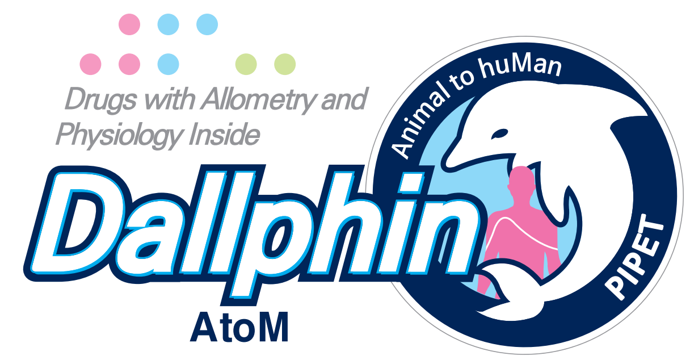
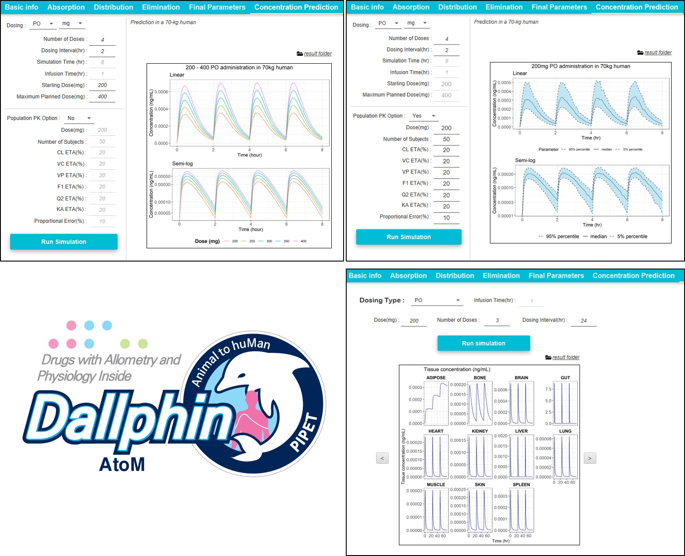
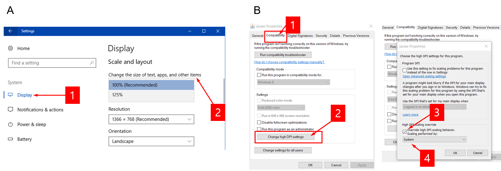

# DallphinAtoM 

**Drugs with Allometry and Physiology Inside** Animal to huMan

<!-- badges: start -->

<!-- badges: end -->

## Installation 

- [Download through Github Releases](https://github.com/pipetcpt/dallphin/releases)

## Functions 

- *In vitro* data to human PK prediction
- Animal PK to human PK prediction
- Population PK simulation
- Full PBPK simulation (perfusion rate-limited kinetics using Kp)

## Workshops

### KSCPT 2019 Spring - Workshop

**Theories and Practices for Human Pharmacokinetics Prediction Using Non-clinical Information**

- Date: 2019-04-25 (Thursday)
- Venue: Healthcare Innovation Park, Seoul National University, Bundang Hospital

### PAGK 2019 - Workshop

**비임상 정보를 이용한 인간 약동학 예측의 이론과 실제: PBPK software, Dallphin**

- Date: 2019-11-29 (Friday)
- Venue: 해운대백병원 5층 세미나실 A

## If Dallphin looks ugly or strange,

If you are using a laptop or an internal or external monitor with Ultra High Definition (4k UHD) using a higher resolution, you might experience the following problems in Dall-Phin.

-	Elements are too small or large compared to the rest of the desktop.
-	Elements such as icons, toolbars, text, and dialog boxes appear to be fuzzy or disoriented.
-	Blurry text appears in Dall-Phin interface.

You can solve these problems by applying one of the following solutions.

1. Change the size of apps: You can right-click on the Desktop (background image) > Display Setting > Change the size of apps, text, and other items on the screen. (100%) (Figure 1A)
2. Change the Java compatibility properties of Javaw.exe: You can find javaw.exe in C:\DAll-Phin\jre\bin in the Explorer and follow these actions: Right click > Properties> Compatibility tab > Change high dpi settings > Click override system settings. (Figure 1B)
 

## Support

- [Brief Guidance](brief-guidance.pdf)
- [Presentation: in vitro](presentations/in-vitro.pdf)
- [Presentation: in vivo](presentations/in-vivo.pdf)

## Acknowledgement

*This research is part of the EDISON (EDucation-research Integration through Simulation On the Net) Program of the National Research Foundation of Korea (NRF) funded by the Ministry of Education, Science and Technology (grant number: 2016M3C1A6936614).*

---

Copyright©2019, All Rights Reserved by Pharmacometrics Institute for Practical Education and Training(PIPET), the Catholic University of Korea.
Reproduction and distribution of the scripts without written permission of PIPET is prohibited.
